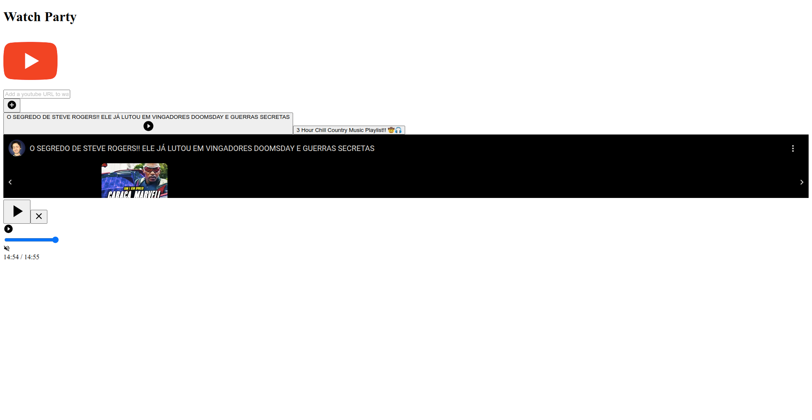

# Bug Report: UI Breaks After Tab Switch

## 🐞 Description
When adding a video and switching to another browser tab for a few minutes, the UI breaks upon returning. Some controls may become unresponsive, and the video playback state might not reflect the actual status.

## 🔎 Steps to Reproduce
1. Open the **Watch Party** app.
2. Add a video to the session.
3. Switch to another browser tab and wait for a few minutes.
4. Return to the **Watch Party** tab.
5. Observe that the UI may appear broken or unresponsive.

## 📷 Screenshot

## 📌 Expected Behavior
The UI should remain functional and properly update the video playback state when switching back to the tab.

---
📝 **Reported by:** [João Felipe]  

